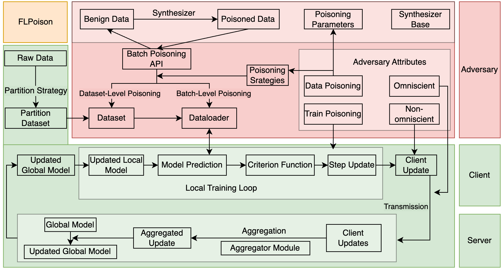

## 项目概览

FLPoison 是一个基于 PyTorch 的联邦学习投毒实验框架，覆盖常见 FL 算法、数据投毒与模型投毒攻击，以及鲁棒聚合防御。这个站点把原来的 `docs/` 文档整理成可搜索、可导航的网页入口。

- 用户手册：安装环境、运行单次训练、本地批量和 Compute Canada 批量。
- 配置手册：`configs/` 目录的字段说明、默认值来源与攻击/防御选项。
- 性能剖析：单次 profiling 工作流、输出文件位置与指标解读。
- 研究资源：支持的数据集与模型关系图、框架逻辑图和 PDF 资料。

## 本地启动文档站

```bash
npm install
npm run docs:dev
```

## 一条最短运行命令

```bash
python -m flpoison --config ./configs/FedSGD_MNIST_Lenet.yaml
```

## 框架逻辑



## 研究资源

- [用户使用手册](/for-users)
- [配置手册](/config-manual)
- [性能 Profiling](/performance-profiling)
- [支持的数据集与模型对照 PDF](/datamodel.pdf)
